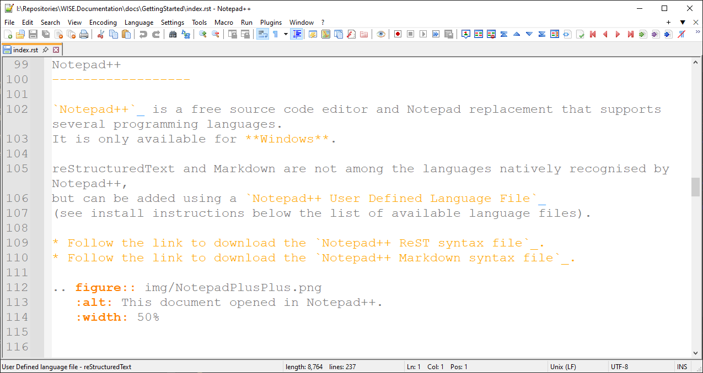
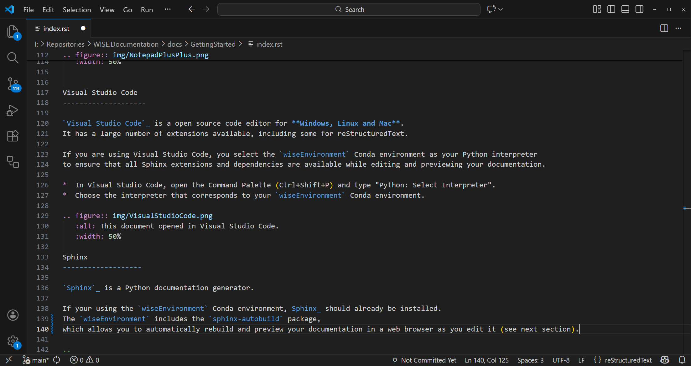

Writing the documentation
================================== 

*  We use Sphinx_ for documentation.
   
   You can write the docs in reStructuredText_ (reST) format, which is a simple and powerful markup language.  
   You can also write the docs in Markdown_ format using MyST_ parser, which is compatible with Sphinx.

   Files with the `.rst` extension are processed as reStructuredText.
   Files with the `.md` extension are processed as Markdown.

   You can choose the format that best suits your needs and preferences.

   If you are a developer working on WISE documentation, you can use `sphinx-autodoc2` for automatic docstring generation.

*  All you need is `Notepad++`_ or any text editor of your choice to create and edit the documentation files. 

*  You can also use `Visual Studio Code`_ for a more feature-rich experience.

*  You you already have documentation in other formats, you may convert it using Pandoc_.

Notepad++
------------------

`Notepad++`_ is a free source code editor and Notepad replacement that supports several programming languages.  
It is only available for **Windows**.

reStructuredText and Markdown are not among the languages natively recognised by Notepad++,
but can be added using the `Notepad++ User Defined Languages Collection`_.

* Follow the link to download the `Notepad++ ReST syntax file`_.
* Follow the link to download the `Notepad++ Markdown syntax file`_.

Visual Studio Code
-------------------- 

`Visual Studio Code`_ is a open source code editor for **Windows, Linux and Mac**.  
It has a large number of extensions available:

* Python extension for Visual Studio Code (ms-python.python): **required**
* MyST Syntax Highlighting (chrisjsewell.myst-tml-syntax): *recommended* if you are using Markdown
* markdownlint (DavidAnson.vscode-markdownlint): useful if you are using Markdown (but you may need to configure and disable some options)
* reStructuredText Syntax highlighting	(trond-snekvik.simple-rst): useful if you are using reStructuredText
* Mermaid (MermaidChart.vscode-mermaid-chart): *recommended* if you are using Mermaid diagrams
* Code Spell Checker (streetsidesoftware.code-spell-checker):  *recommended* as a spell checker

Anyway... you just need the Python extension:

* Activate `wiseEnvironment` Conda environment as your Python environment
  to ensure that all Sphinx extensions and dependencies are available 
  while editing and previewing your documentation.  

*  In Visual Studio Code, open the Command Palette (Ctrl+Shift+P) and type "Python: Select Interpreter".
   Choose the interpreter that corresponds to your `wiseEnvironment` Conda environment.
   If you don't remember were the `python.exe` file is, check the location of your environment using a terminal window and:

   .. code-block:: bash

      conda env list

* If you are using a git repository, add the `.vscode` folder to your `.gitignore` file.

Pandoc
-----------------

`Pandoc`_ is a free and open-source document converter, available for **Windows, Linux and Mac**.

It can convert files in formats such as HTML, PDF, DOCX, ODT, etc. 
to and from reStructuredText_ and Markdown_ (including the CommonMark_ flavour supported by Sphinx_ and GitHub_). 

You can use it to convert existing documents to `*.rst` or `*.md` format,
before editing them with a text or code editor (e.g. Notepad++, Visual Studio Code).

.. code-block:: bash

   pandoc --from=docx --to=rst --output=myfile.rst --extract-media=img myfile.docx  

Refer to https://pandoc.org/MANUAL.html for a full list of options (besides the ones listed below).

.. include:: pandocQuickReference.txt   

.. links-placeholder

.. include:: ../_sharedFiles/Links.rst